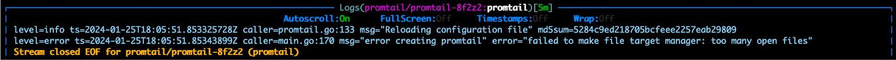
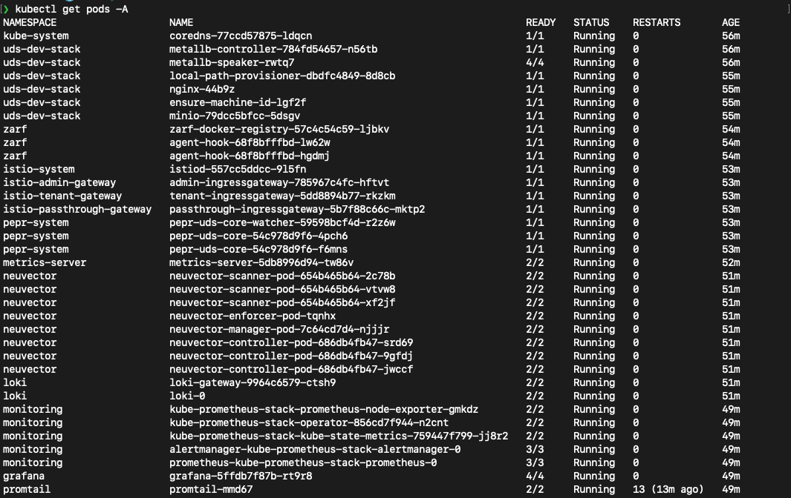
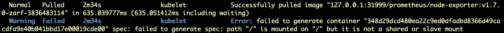
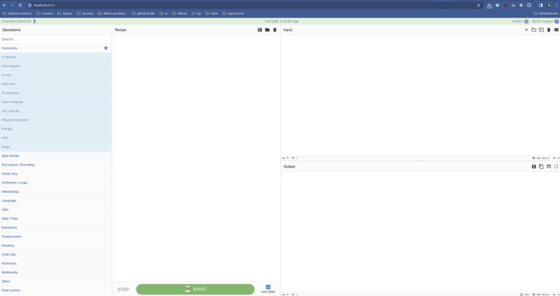

# cache-money-dd0124

## Objective: Deploy UDS Core with an open-source app on top
For Dash Days January 2024, James Allen, Lauren Mengert, and Brandi McCall set a goal to deploy uds-core with the open-source application OpenVAS. OpenVAS is an open-source vulnerability scanner that identifies and assesses weaknesses in computer systems, networks, and applications, allowing you to proactively pinpoint security issues within an IT infrastructure before malicious actors can exploit them. We felt this would be a great proof of concept of how mission heroes can take any open-source application and quickly get it up and running in the uds-core setting. Of note, none of us had worked with uds-core prior to this Dash Days, so we relied heavily on utilizing the Slack uds-core channel when issues arose. Thanks, UDS team! 

## UDS Core Deployment Obstacles Discovered
We initially had some difficulty getting uds-core to deploy consistently. We attempted to deployed uds-core using the k3d-core-demo bundle on three different machines with the following command:

`uds deploy oci://ghcr.io/defenseunicorns/packages/uds/bundles/k3d-core-demo:amd64` 

This command would not work without including a version. Specifically, it would not initiate the k3d cluster. We reached out in the uds-core Slack channel, and it appears other users have had this issue as well, and a fix is being developed. Adding the bundle version seemed to work:

`uds deploy oci://ghcr.io/defenseunicorns/packages/uds/bundles/k3d-core-demo:0.9.2-amd64`

As mentioned previously, we deployed uds/bundles/k3d-core-demo on three different machines:

* Machine 1 - Multipass VM with Ubuntu 22.04
* Machine 2 - Deskmeet with Ubuntu Server 22.04.3
* Machine 3 - Intel NUC 13 Pro Kit with Ubuntu 22.04

When deploying uds-core to all of the machines, we ran into a file issue with Promtail:



This error suggested that Promtail was hitting the file descriptor limit on the system. This limit restricts the number of files an individual process can open simultaneously. We made the following changes to fix the issue:

```
cd /etc/sysctl.d/
sudo vim 99-k8s.conf
    Contents:
      vm.max_map_count=1524288
      fs.inotify.max_user_instances=8192
sudo chmod 644 99-k8s.conf

cd /etc/security/limits.d/
sudo vim 99-k8s.conf
    Contents:
      * hard nofile 1000000
      * soft nofile 1000000
      * hard nproc 8192
      * soft nproc 8192
sudo chmod 644 99-k8s.conf
```
Explanation of what this accomplished:

* `vm.max_map_count=1524288` 
Increased the maximum number of memory map areas a process may have.
* `fs.inotify.max_user_instances=8192`
Increased the limit on the number of inotify instances. This is particularly useful if you have many processes (like Promtail) monitoring files for changes.
* `* hard nofile 1000000` and `* soft nofile 1000000`
This increased the number of file descriptors any user can open to 1,000,000, thus preventing the "too many open files" error for Promtail and other processes.
 * `* hard nproc 8192` and `* soft nproc 8192`
This increased the number of processes (or threads) a user can spawn to 8,192, which is important in environments where many processes are expected.

After creating these two files and adjusting permissions, we ran `sudo sysctl --system` to apply the changes. We then ran `kubectl get pods -A` and saw that Promtail was now running.



While this fixed the Promtail issue, Machine 3 had an additional error where Prometheus was having volume mount issues:



We were not able to resolve this error in a timely manner and suspected it was specific to the machine it was running on, so we opted to change Machine 3 to using a Multipass VM as well using the init script found [here](https://github.com/bm54cloud/cache-money-dd0124/tree/main/multipass/uds-core). This init script includes the above file descriptor limit fix, so uds-core deployed smoothly on this VM.

## OpenVAS Deployment Obstacles Discovered
After getting uds-core-k3d-demo bundle deployed and confirming all pods were up and running, we worked on creating a Zarf package of OpenVAS. We needed to customize the OpenVAS chart to work with uds-core, so we copied it into our temporary Dash Days repo and noted that it used Traefik as an ingress controller, whereas uds-core uses Istio. We completely turned off Traefik but then ran into an issue where the default policy for uds-core’s Pepr deployment was blocking OpenVAS’ requested capabilities of **net_admin** and **net_raw**. Pepr's default policy under uds-core appeared to only allow **net_bind_service**. As a workaround, we installed OpenVAS in the `uds-dev-stack` namespace to bypass Pepr's policy enforcement.

This is not an ideal solution, but we didn’t feel we had the time this Dash Days to reconfigure Pepr to work with our specific application.

After moving to the uds-dev-stack namespace, we disabled the chart’s mTLS configuration and Traefik components. This allowed us to place the Istio Virtual Service component to replace the Traefik functionality from the openVAS chart.

At this point, things were starting to look promising for successfully running the app, but we could not load the web console for openVAS. After further investigation, Greenbone’s OpenVAS Helm chart did not seem to include the container needed to serve the web interface based on comparing the images in the chart and the equivalent docker-compose file found in their documentation.

## Let's Try Something Else: CyberChef
Given all the issues we ran into with OpenVAS, we briefly looked at CyberChef and felt it was a much cleaner app to try and deploy on top of uds-core. CyberChef appeared to be a minimal container image that runs in a web browser with no specific system requirements. We redeployed a fresh uds-core baseline, created a Zarf package for CyberChef, and deployed it. With CyberChef being a less complex application, we didn't run into any ingress issues, and it passed through Pepr's default policies with ease (our prayers to the Pepr Gods worked!). 

Since all of our clusters were running in VMs or on our home labs, we accessed the CyberChef UI by adding a DNS entry to our /etc/hosts file and creating an SSH tunnel to forward DNS traffic.



## What We ❤ About UDS Core
While we did run into some difficulty deploying certain apps on top of UDS Core, this was really the result of the app's requested Linux capabilities. In contrast to OpenVAS, CyberChef deployed quickly on the first attempt. In addition to this app deploying easily, deploying the UDS Core baseline proved to be extremely user-friendly and relatively quick. We definitely see the value in UDS Core and are excited to continue learning more about it and rolling it out to our Mission Heroes!